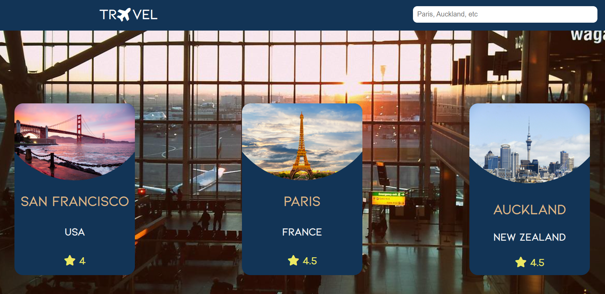

<p align="center">
    
</p>

## Introduction
This is a travel web application where you can choose your destination  
for your next holidays :wink: !

## Prerequisites
- go 1.17 or earlier
- Recent browser
- Terminal

## Technologies
- Static: 
    - HTML5
    - CSS3
    - Javascript
- Dynamic:
    - Golang
## Installation 
1. Download the whole project `Travel` on your system
2. Open your terminal in `Travel`
```
cd Travel
```
3. Run `main.go` using the following command line
```
go run main.go
```
4. If there is no error. Go on your favorite browser and use this line in your URL address bar
```
http://localhost:8080
```
5. Here you are! Welcome in the main page of the Web application



<!-- ## How to use -->
<!-- Main explanations to use the web application: Features, possibilities, etc -->

## To Do
- Fix responsive
- Add a search bar
- Generate with Golang the code for stars
- Error manager
- Prefer an `background-image` instead of `background-color`
- Use modules
